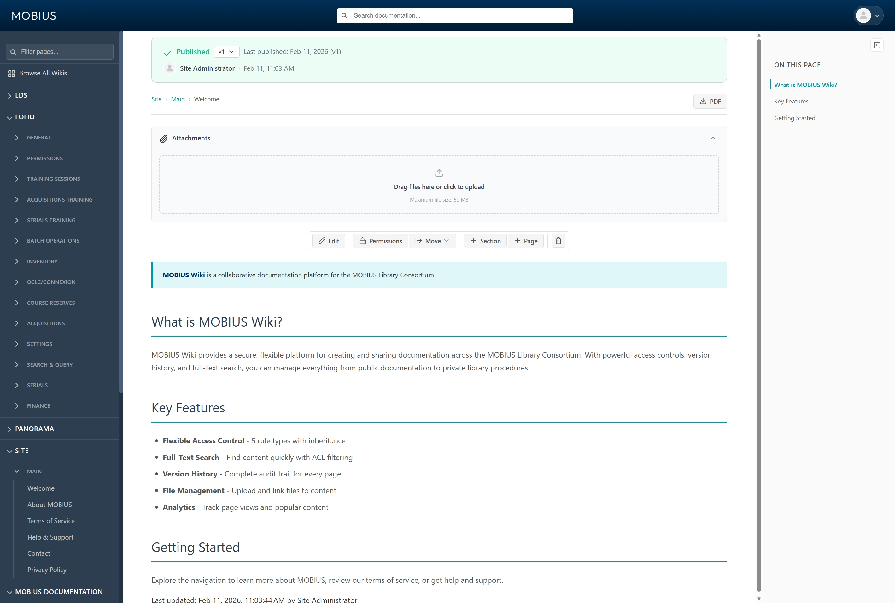

# MOBIUS Wiki

<p align="center">
  
</p>

<p align="center">
  
  
  
  
  
  
</p>

---

A collaborative documentation platform and secure content delivery system for the MOBIUS Library Consortium. MOBIUS Wiki provides a structured way to create, manage, and share knowledge across library staff and member institutions.

## Features

- **Multi-Wiki Support** - Create and manage multiple wikis with separate content hierarchies
- **Role-Based Access Control** - Fine-grained ACL system with user, group, and wiki-level permissions
- **Page Version History** - Track all changes with full revision history and rollback capability
- **File Management** - Upload, organize, and embed files with automatic MIME type detection
- **Rich Text Editing** - Self-hosted TinyMCE 7 WYSIWYG editor with custom templates
- **Tagging System** - Organize content with tags for improved discoverability
- **Section Management** - Structure pages with collapsible sections and templates
- **Audit Logging** - Complete audit trail of user actions for compliance
- **Session-Based Authentication** - Secure session management with PostgreSQL session store

## Prerequisites

- Node.js 20.x
- npm 10.x
- Docker (for PostgreSQL)
- Git

## Quick Start

### 1. Clone and Install

```bash
git clone <repository-url>
cd mobius-wiki

# Backend
cd backend
npm install
npm run db:setup

# Frontend
cd ../frontend
npm install
```

### 2. Start Development Servers

```bash
# Terminal 1 - Backend (port 10000)
cd backend
npm run start:dev

# Terminal 2 - Frontend (port 4200)
cd frontend
ng serve
```

### 3. Access the Application

- **Frontend**: http://localhost:4200
- **Backend API**: http://localhost:10000
- **Health Check**: http://localhost:10000/api/v1/health

## Development

### Test Credentials

| Email | Password |
|-------|----------|
| admin@mobius.org | admin123 |

### Database Commands

```bash
cd backend

npm run db:setup          # Full setup (create, migrate, seed)
npm run migrate           # Run migrations only
npm run db:seed           # Seed sample data
npm run sql "SELECT ..."  # Run SQL queries
npm run sql -- --tables   # List all tables
```

### Environment Configuration

Backend environment variables are configured in `backend/.env`:

```env
DATABASE_HOST=localhost
DATABASE_PORT=5432
DATABASE_NAME=mobius_wiki
DATABASE_USER=postgres
DATABASE_PASSWORD=postgres
FRONTEND_URL=http://localhost:4200
```

## Project Structure

```
mobius-wiki/
├── backend/                 # NestJS API server
│   ├── src/
│   │   ├── auth/           # Authentication module
│   │   ├── wikis/          # Wiki management
│   │   ├── pages/          # Page CRUD operations
│   │   ├── sections/       # Section management
│   │   ├── files/          # File uploads
│   │   ├── tags/           # Tagging system
│   │   └── common/         # Shared utilities
│   ├── migrations/         # SQL migrations
│   └── seeds/              # Sample data
├── frontend/               # Angular application
│   ├── src/
│   │   ├── app/
│   │   │   ├── core/       # Services, guards, interceptors
│   │   │   ├── pages/      # Route components
│   │   │   └── shared/     # Reusable components
│   │   └── styles/         # Global stylesheets
└── docs/                   # Documentation
    ├── api/                # API documentation
    ├── guides/             # Development guides
    ├── standards/          # Coding standards
    └── architecture/       # Architecture docs
```

## Documentation

| Document | Description |
|----------|-------------|
| [Development Setup](docs/guides/development-setup.md) | Complete environment setup guide |
| [API Documentation](docs/api/) | Backend API reference |
| [Architecture Overview](docs/architecture/overview.md) | System design and patterns |
| [Security Guide](docs/standards/security.md) | Security best practices |
| [TinyMCE Guide](docs/guides/tinymce-editor.md) | Editor configuration |

## License

Copyright MOBIUS Library Consortium. All rights reserved.
